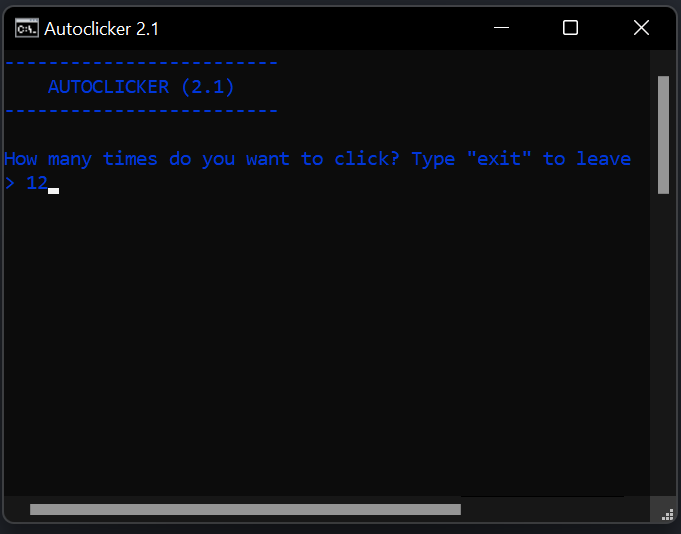

# AUTOCLICKER
This program is a simple autoclicker which will do nothing but spam the click button (I guess). You just have to execute the program, enter the amount of times you want the program to click and wait 5 seconds. Now, here is a detailed tutorial on how to properly use it, step by step, from cold and dark.

Dedicado a cierta persona con las siglas GAGA ;)

## How to use it
### - Go to the [executable file](https://github.com/sokopy/autoclicker/blob/master/autoclicker.exe) and click "download"

### - Open the file, enter the amount of clicks and press "enter"

### - Enter the waiting time in seconds
#### <mark style="background-color: orange;">Please do not skip this step, as the waiting time will let you change between applications and get ready</mark>

### - Have fun while cheating at CPS tests!

or any other thing you could use this for...

